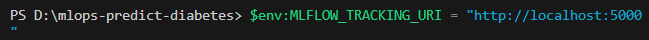

install locust
locust --locustfile=.\src\load_test.py
install mlflow
pip install lightgbm
pip install make

# Run trainfile

$python src/train.py --model_name xgb
$env:MLFLOW_TRACKING_URI = "http://localhost:5000" then you can run python .\src\train.py --model_name xgb

pip install fastapi
pip install opentelemetry-sdk  
 pip install opentelemetry-exporter-jaeger  
 pip install opentelemetry-instrumentation-fastapi
pip install prometheus-fastapi-instrumentator
pip install opentelemetry-instrumentation

- Start-Process python -ArgumentList ".\src\final_outcome.py" -WindowStyle Hidden
- Get-WmiObject Win32*Process | Where-Object { $*.Name -eq 'python.exe' } | Select-Object ProcessId, CommandLine
- Stop-Process -Id 14916
